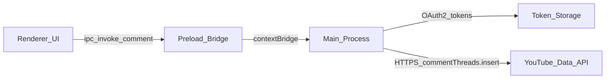

# Automating YouTube comments in an Electron app

## Feasibility

**Yes, it is possible.** Electron is Node.js + Chromium, so the same **OAuth 2.0** and **YouTube Data API v3** flow you would use in a server or CLI works in the **main process** (recommended). The UI only needs to start auth, show status, and let the user input video id / comment text.

## High-level architecture

- **Main process**: OAuth2, refresh tokens, all `googleapis` (or `fetch`) calls, quota and error handling.
- **Preload**: Expose a **minimal** API (`postComment`, `startAuth`, `getAuthStatus`) via `contextBridge`; no raw tokens to the renderer if you can avoid it.
- **Token storage**: Persist `refresh_token` (and optionally `access_token`) using something appropriate for desktop—e.g. **Electron** [`safeStorage`](https://www.electronjs.org/docs/latest/api/safe-storage) with a local encrypted file, or **keytar** on supported OSes. Avoid plain JSON on disk for production.

## Google Cloud / YouTube side (you said you have this, listed for the plan)

- Enable **YouTube Data API v3** on the project.
- Configure **OAuth 2.0** credentials: **Desktop app** (or “Installed application”) is the usual match for Electron; set redirect URI to **`http://127.0.0.1:<port>/`** or a **custom protocol** (e.g. `myapp://oauth`) registered in the app, exactly as in Google Cloud Console.
- **OAuth scopes** must include the ability to post comments. Use the scope set documented for the **insert** methods you need (e.g. top-level `commentThreads.insert` / reply `comments.insert`); follow [Google’s scope list](https://developers.google.com/youtube/v3/docs/) for the exact `https://www.googleapis.com/auth/...` string(s) for your use case.
- **Quota**: each `insert` costs quota units; handle **429** / quota errors in the main process.

## Implementation outline (code shape)

1. **Dependencies (main)**: `googleapis` (wraps YouTube Data API) or use REST with `fetch` + manual OAuth token refresh.
2. **Auth loop**: Open the **system browser** or an **in-app** `BrowserWindow` to the Google consent URL; run a **local HTTP server** on a fixed port, or a **custom-protocol** deep link, to catch the `code` and exchange for tokens. Store the refresh token after first successful consent.
3. **YouTube client**: After auth, `youtube.commentThreads.insert` (and `youtube.comments.insert` for replies) with:
   - `part: 'snippet'`
   - `snippet` fields as required by the API (e.g. `channelId` / `videoId` / `topLevelComment` for threads—follow the official request body for your scenario).
4. **IPC**: Renderer calls e.g. `window.api.postComment({ videoId, text })` → main validates input → main calls API → returns success/error to UI.

## Security and packaging notes

- **Never** ship `client_secret` in public builds if the credential is considered secret; for **public desktop** apps, Google’s model often uses an **Installed app** / PKCE flow—follow current Google documentation for your credential type.
- **CSP** and `contextIsolation: true` + `nodeIntegration: false` in the renderer are the standard baseline.

## What is *not* required

- You do not need to automate the **website** (Playwright in Electron) if you use the **official API**; that keeps behavior aligned with API ToS and is easier to reason about.

## Suggested first milestone

Minimal vertical slice: **one button “Sign in with Google”** → **post one test comment to a video ID** using the main process, then add scheduling/queues only after that works.
